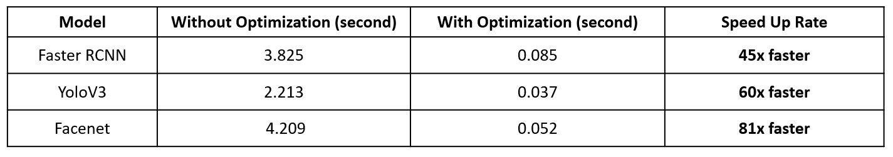

# Computer Vision API

Example Object Detection API using SSD_Resnet

#### Requirement
+ djangorestframework 
+ opencv
+ numpy
+ pillow

# Penggunaan Object Detection API

**Step 1, Download Model**

Download model SSD_Resnet pada link berikut https://bit.ly/3kjIPXv. lalu ekstrak ke direktori "simple_object_detection" dan ke direktori "my_api/app_object_detection"


**Step 2, Call API**

Untuk pemanggilan API dapat menggunakan tools postman https://www.postman.com/, dengan spesifikasi request sebagai berikut

##### Method,

```
POST
```

##### End-Point,

```
http://127.0.0.1:8000/object_detection/api/
```

##### Request Header, 

```
Accept : application/json                    
Content-type : multipart/form-data
```                 

##### Request Param,

```
input_image : File, type=image/jpg
mode : integer, option= 1 or 2
```

**Example Result**


# Tahapan Develop Object Detection API

**Step 1, Instalasi Library**

```
pip install djangorestframework
```

**Step 2, Create Django Project**

Buat projek baru menggunakan command berikut, dimana "my_api" pada tutorial ini merupakan nama projeknya.

```
django-admin startproject my_api
```

setelah command diatas dijalankan, akan terbentuk folder baru "my_api" dengan susunan direktori sebagai berikut,

    my_api
    │
    ├── my_api                    
    │   ├── __init__.py
    │   ├── asgi.py
    │   ├── settings.py
    │   ├── urls.py
    │   └── wsgi.py
    │
    └── manage.py
    
    
**Step 3, Change Directory**

pindahkan direktori ke my_api

```
cd my_api
```
    
    
**Step 4, Create New Application**

Buat aplikasi baru menggunakan command berikut, dimana "app_object_detection" kita set sebagai nama aplikasinya.

```
python manage.py startapp app_object_detection
```

setelah command diatas dijalankan, akan terbentuk folder baru "app_object_detection". Dengan demikian direktori kita sekarang akan menjadi seperti berikut

    my_api
    │
    ├── my_api                    
    │   ├── __init__.py
    │   ├── asgi.py
    │   ├── settings.py
    │   ├── urls.py
    │   └── wsgi.py
    │
    ├── app_object_detection                    
    │   ├── migrations
    │   │   └── __init__.py
    │   ├── __init__.py 
    │   ├── admin.py
    │   ├── apps.py
    │   ├── models.py
    │   ├── tests.py
    │   └── views.py
    │   
    └── manage.py
    
    
**Step 5, Define Method object_detection_api**

Source code Object Detection yang telah disusun sebelumnya, kita salin ke file "my_api/app_object_detection/views.py". Lalu kita edit menjadi seperti berikut

views.py ([view code](docs/archieve_views_v1.py))


**Step 6, Add csrf_exempt** 

Pastikan menambahkan tag @crsf_exempt diatas method object_detection_api, agar API dapat diakses tanpa menggunakan token


**Step 7, Config End Point**

Import method object_detecion_api ke file "my_api/my_api/urls.py"


lalu tambahkan end point yang diinginkan seperti contoh berikut ini,


urls.py ([view code](docs/archieve_views_v1.py))


**Step 8, Add MEDIA URL**

Agar image hasil deteksi dapat diakses secara langsung dari client, perlu kita generate direct URL terhadap image yang tersimpan di server api. Untuk melakukan hal tersebut, tambahkan code berikut ke file "my_api/my_api/settings.py" di akhir line, seperti berikut ini,

```
import os
MEDIA_ROOT  = os.path.join(BASE_DIR, 'media')
MEDIA_URL = '/media/'
```


import library berikut pada file "my_api/my_api/urls.py"

```
from django.conf.urls.static import static
from django.conf import settings
```


tambahkan code berikut pada file "my_api/my_api/urls.py"

```
+ static(settings.MEDIA_URL, document_root=settings.MEDIA_ROOT)
```


urls.py ([view code](docs/archieve_urls_v2.py))


**Step 9, Run API Server**

gunakan command berikut untuk menjalankan server API dalam mode development

```
python manage.py runserver
```


# Optimize Object Detection API

**Step 1, Create Class object_detection**

Ubah method object_detection_api kedalam bentuk class, seperti berikut. Lalu simpan di direktori "my_api/app_object_detection"

object_detection.py ([view code](my_api/app_object_detection/object_detection.py))


**Step 2, Implement Class Model**

Hal yang menentukan perubahan kecepatan object detection API terdapat pada implementasi Class Model. Dengan ini, proses loading model dapar di cut, agar hanya dijalankan satu kali saja saat server API pertama kali dijalankan. Update file "my_api/app_object_detection/models.py", seperti berikut ini.

models.py ([view code](my_api/app_object_detection/models.py))

**Step 3, Update INSTALLED_APPS**

Karena sekarang kita mengimplementasi Class Model. Maka app_object_detection perlu ditambahkan kedalam list INSTALLED_APPS, agar Class Model dapat diakses. Edit file "my_api/my_api/settings.py" seperti berikut.


settings.py ([view code](my_api/my_api/settings.py))

**Step 4, Update Views**

Untuk simulasi, kita tambahkan opsi untuk dapat menggunakan dua skema deteksi. Skema pertama merupakan Object Detection API tanpa optimasi, dan skema 2 merupakan Object Detection API setelah di optimasi. Edit file "my_api/app_object_detection/views.py" menjadi seperti berikut,


import Class Model Detector


Add Method detect_object_v2


views.py ([view code](my_api/app_object_detection/views.py))

# Speed Comparison

```
[Mean Execution Time] Skema 1 :  0.1314366340637207

[Mean Execution Time] Skema 2 :  0.08843120336532592
```

